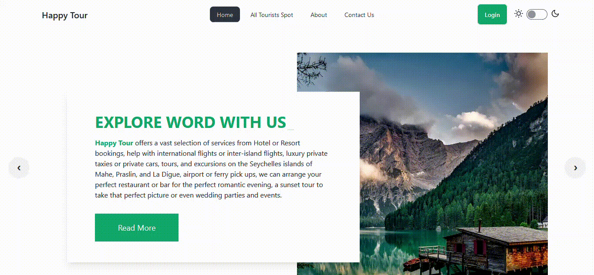

<h1 align="center">Happy Tour</h1>

<p align="center">
  
</p>
<br>

## Live Link:

[https://happy-tour-d80ae.web.app](https://happy-tour-d80ae.web.app/)

Server Repo Link: [Happy-Tour-Server-Repo](https://github.com/younusFoysal/Happy-Tour-Server)

## Overview:
- **Comprehensive Travel Planning:** Simplifies booking and organizing trips for various durations and destinations.
- **Enhanced Travel Experience:** Aims to provide a seamless and enjoyable travel experience by offering all necessary tools and information.


## Features: 
* User can Login with Google & Github account.
* User can Add,Update, Delete Tourists spots.
* Have 9 different Tourists spots details.
* User see the list of Tourist places those are added by him.
* Contact Us page contains a map with Company location.


Installed Npm Packages:
```
Firebase
Google Map React
Moment
react
react-dom
react-icons
react-hook-form
react-router-dom
react-toastify
react-tooltip
react-simple-typewriter
sort-by
sweetalert2
daisyui
postcss
tailwindcss
vite
react-leaflet
react-fast-marquee
aos
animate.css
react-helmet-async
```


### How to Set Up Locally

1. Install npm packages:
    ```sh
    npm i
    ```
2. Create a `.env.local` file containing API keys and Firebase credentials.
3. Run the API server from [Happy-Tour-Server](https://github.com/younusFoysal/Happy-Tour-Server).
4. Run the development server:
    ```sh
    npm run dev
    ```
5. Browse the application at:
    ```sh
    http://localhost:5173/
    ```

